# A2A Chat Orchestrator & Intelligent Query Processing Analysis

## Executive Summary

This analysis examines the A2A (Agent-to-Agent) chat orchestrator and Intelligent Query Processing systems to identify adoption opportunities for the Document Chat feature and customer experience improvements for multi-agent orchestration.

## 1. A2A Chat Orchestrator Analysis

### 1.1 Core Architecture

**A2A Service (Port 5008):**
- **Framework**: Flask-based service implementing Strands A2A framework
- **Data Models**: 
  - `A2AAgent`: Agent representation with capabilities, endpoints, status
  - `A2AMessage`: Inter-agent communication with metadata and execution tracking
  - `A2AConnection`: Bidirectional connections between agents
- **Key Features**:
  - Agent registration and discovery
  - Message routing and delivery
  - Connection management
  - Session timeout handling (5 minutes)

**Chat Orchestrator API (Port 5005):**
- **Purpose**: Intelligent chat routing and agent orchestration
- **Chat Types**: Direct LLM, Independent Agents, Palette Agents
- **Database**: SQLite for session and message persistence
- **Features**:
  - Multi-agent chat sessions
  - Agent routing with confidence scoring
  - Real-time message handling
  - Session management

### 1.2 Enhanced Orchestration API (Port 5014)

**6-Stage Orchestrator Implementation:**
1. **Contextual Query Analysis**: Intent, domain, complexity detection
2. **Sequence Definition**: Workflow step planning
3. **Execution Strategy Detection**: Single/sequential/parallel execution
4. **Comprehensive Agent Analysis**: Agent suitability scoring
5. **Intelligent Agent Matching**: Best agent selection
6. **Orchestration Plan & Final Synthesis**: Response coordination

**Advanced Features:**
- LLM-powered query analysis using `qwen3:1.7b`
- Memory-efficient execution with cleanup
- Dynamic agent routing based on metadata
- Response synthesis and formatting
- Memory threshold monitoring (85%)

### 1.3 Frontend Orchestration Components

**Real-time Monitoring:**
- `RealTimeOrchestrationMonitor`: Live step-by-step orchestration tracking
- `AdvancedOrchestrationMonitor`: Comprehensive orchestration visualization
- `A2AOrchestrationPanel`: Simple orchestration interface
- WebSocket integration for real-time updates

**Key UI Features:**
- Progress tracking with step-by-step visualization
- Agent status monitoring
- Execution time tracking
- Error handling and recovery
- Detailed orchestration logs

## 2. Current Document Chat Limitations

### 2.1 Architecture Constraints
- **Single-threaded processing**: No multi-agent coordination
- **Basic RAG**: Simple document retrieval without intelligent routing
- **Limited context**: No cross-document analysis or synthesis
- **No orchestration**: Direct LLM queries without agent coordination

### 2.2 User Experience Issues
- **No progress tracking**: Users don't see processing stages
- **Limited feedback**: No real-time status updates
- **No agent selection**: Users can't choose specialized agents
- **Basic error handling**: Limited troubleshooting guidance
- **No multi-step workflows**: Can't handle complex document analysis tasks

## 3. Adoption Opportunities for Document Chat

### 3.1 High-Value Adoptions

**A. 6-Stage Orchestrator Integration**
```typescript
// Enhanced Document Query Processing
interface DocumentOrchestrationSession {
  session_id: string;
  query: string;
  documents: string[];
  analysis_stages: {
    stage_1_query_analysis: QueryIntent;
    stage_2_sequence_definition: ProcessingSteps;
    stage_3_execution_strategy: ExecutionPlan;
    stage_4_agent_analysis: AgentSelection;
    stage_5_agent_matching: BestAgents;
    stage_6_synthesis: FinalResponse;
  };
  progress: OrchestrationProgress;
}
```

**B. Real-time Progress Monitoring**
- Adopt `RealTimeOrchestrationMonitor` patterns
- Show document processing stages
- Display agent coordination in real-time
- Provide detailed execution logs

**C. Multi-Agent Document Processing**
- **Research Agent**: Document analysis and summarization
- **Calculator Agent**: Numerical data extraction and computation
- **Coordinator Agent**: Cross-document synthesis
- **Specialized Agents**: Domain-specific document processing

### 3.2 Technical Implementations

**A. Enhanced Document RAG Service**
```typescript
class OrchestratedDocumentRAGService {
  async processQueryWithOrchestration(query: string, documents: string[]) {
    // Stage 1: Analyze query complexity and requirements
    const queryAnalysis = await this.analyzeQuery(query);
    
    // Stage 2: Define processing sequence
    const processingSteps = await this.defineProcessingSequence(queryAnalysis, documents);
    
    // Stage 3: Select appropriate agents
    const selectedAgents = await this.selectAgents(processingSteps);
    
    // Stage 4-6: Execute orchestration
    return await this.executeOrchestration(selectedAgents, processingSteps);
  }
}
```

**B. Document-Specific Agents**
- **Document Analyzer**: Extract key information and structure
- **Content Synthesizer**: Combine information from multiple documents
- **Question Answerer**: Generate precise answers with citations
- **Summary Generator**: Create executive summaries and insights

## 4. Customer Experience Improvements

### 4.1 Enhanced User Interface

**A. Intelligent Query Interface**
```typescript
interface SmartDocumentQuery {
  query: string;
  suggested_agents: AgentSuggestion[];
  complexity_analysis: ComplexityLevel;
  estimated_time: number;
  processing_strategy: ProcessingStrategy;
}
```

**B. Real-time Processing Dashboard**
- **Progress Visualization**: Step-by-step orchestration progress
- **Agent Status**: Live agent availability and performance
- **Resource Monitoring**: Memory usage, processing time, model status
- **Interactive Controls**: Pause, resume, cancel operations

**C. Advanced Document Management**
- **Document Clustering**: Group related documents automatically
- **Smart Search**: Multi-modal search across document types
- **Citation Tracking**: Trace answers back to specific document sections
- **Version Control**: Track document changes and updates

### 4.2 Intelligent Features

**A. Query Understanding**
- **Intent Recognition**: Automatically detect query complexity and type
- **Context Awareness**: Understand user's document context and goals
- **Proactive Suggestions**: Recommend related queries and analyses
- **Learning System**: Improve suggestions based on user patterns

**B. Multi-Document Intelligence**
- **Cross-Document Analysis**: Find connections between different documents
- **Conflict Detection**: Identify contradictory information
- **Trend Analysis**: Track changes and patterns across document sets
- **Knowledge Synthesis**: Create comprehensive insights from multiple sources

**C. Collaborative Features**
- **Shared Workspaces**: Multiple users working on same document sets
- **Annotation System**: Add notes and highlights to documents
- **Discussion Threads**: Contextual discussions about specific content
- **Export Options**: Generate reports, summaries, and presentations

## 5. Implementation Recommendations

### 5.1 Phase 1: Core Orchestration (2-3 weeks)

**A. Backend Integration**
1. Extend Document RAG Service with orchestration capabilities
2. Implement 6-stage orchestrator for document queries
3. Create document-specific agent endpoints
4. Add real-time progress tracking

**B. Frontend Enhancements**
1. Integrate real-time monitoring components
2. Add orchestration progress visualization
3. Implement intelligent query interface
4. Create advanced document management UI

### 5.2 Phase 2: Advanced Features (3-4 weeks)

**A. Multi-Agent Document Processing**
1. Deploy specialized document agents
2. Implement cross-document analysis
3. Add citation and source tracking
4. Create document relationship mapping

**B. User Experience Improvements**
1. Add collaborative features
2. Implement smart suggestions
3. Create advanced export options
4. Add learning and personalization

### 5.3 Phase 3: Intelligence & Automation (4-5 weeks)

**A. AI-Powered Features**
1. Implement query intent recognition
2. Add proactive content suggestions
3. Create automated document analysis
4. Build knowledge synthesis capabilities

**B. Advanced Analytics**
1. Add usage analytics and insights
2. Implement performance optimization
3. Create user behavior analysis
4. Build recommendation engine

## 6. Technical Architecture

### 6.1 Enhanced Document Chat Architecture

```mermaid
graph TB
    A[User Query] --> B[6-Stage Orchestrator]
    B --> C[Query Analysis]
    B --> D[Agent Selection]
    B --> E[Processing Strategy]
    
    C --> F[Document Analyzer Agent]
    C --> G[Content Synthesizer Agent]
    C --> H[Question Answerer Agent]
    
    F --> I[Document Processing Pipeline]
    G --> I
    H --> I
    
    I --> J[Response Synthesis]
    J --> K[Real-time Updates]
    K --> L[Enhanced UI]
```



### 6.2 Data Flow

1. **Query Reception**: User submits query with document selection
2. **Orchestration Analysis**: 6-stage analysis determines processing approach
3. **Agent Coordination**: Multiple agents work on different aspects
4. **Real-time Updates**: Progress tracked and displayed to user
5. **Response Synthesis**: Final response combines all agent outputs
6. **Citation & Sources**: Complete traceability to source documents

## 7. Success Metrics

### 7.1 Performance Metrics
- **Query Processing Time**: Target <30 seconds for complex multi-document queries
- **Agent Coordination Efficiency**: >95% successful agent coordination
- **Response Quality**: User satisfaction >90% for orchestrated responses
- **System Reliability**: >99% uptime for orchestration services

### 7.2 User Experience Metrics
- **Task Completion Rate**: >85% of complex queries successfully processed
- **User Engagement**: >70% of users utilize advanced orchestration features
- **Feature Adoption**: >60% adoption of multi-agent document processing
- **Customer Satisfaction**: >4.5/5 rating for enhanced document chat

## 8. Conclusion

The A2A chat orchestrator and Intelligent Query Processing systems provide a robust foundation for transforming the Document Chat feature into a sophisticated multi-agent orchestration platform. The key opportunities include:

1. **Technical Adoption**: 6-stage orchestrator, real-time monitoring, multi-agent coordination
2. **User Experience**: Enhanced progress tracking, intelligent interfaces, collaborative features
3. **Intelligence**: Query understanding, cross-document analysis, proactive suggestions
4. **Scalability**: Modular architecture supporting specialized document processing agents

Implementation should follow a phased approach, starting with core orchestration capabilities and progressively adding advanced intelligence and automation features.
