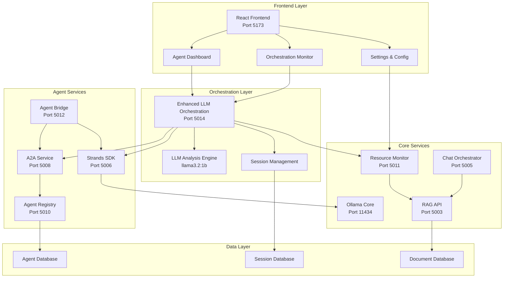
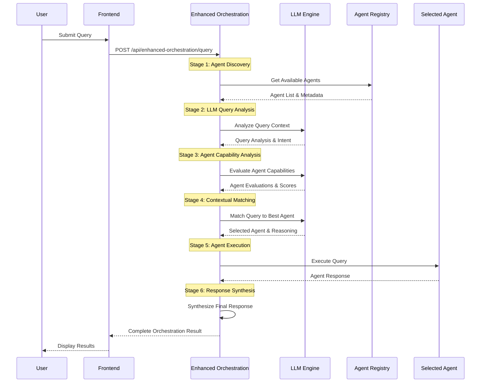
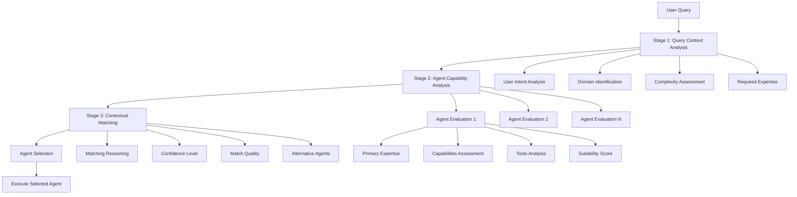
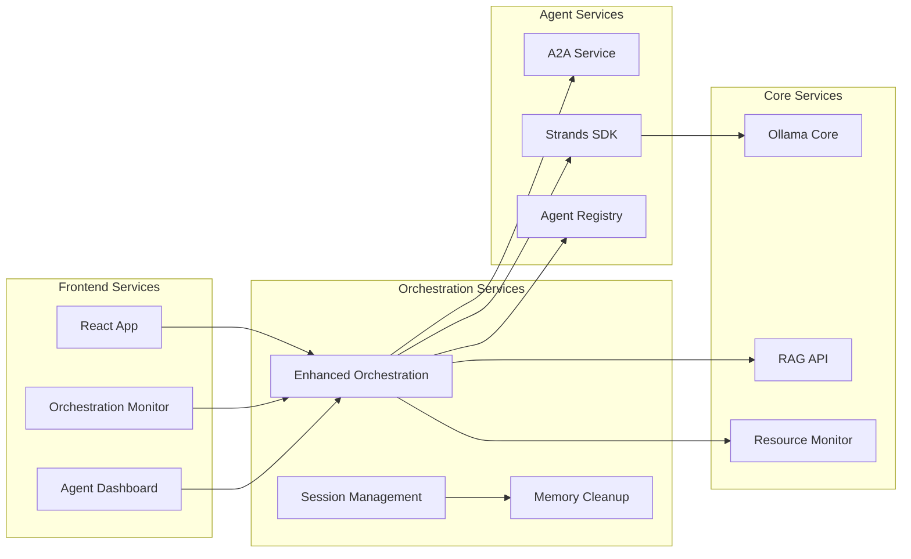
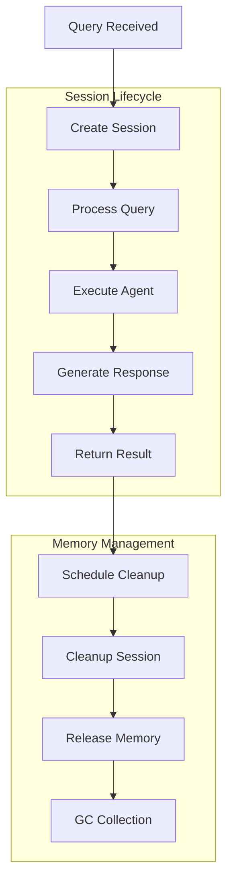
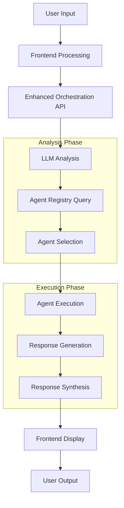
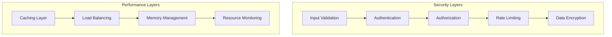
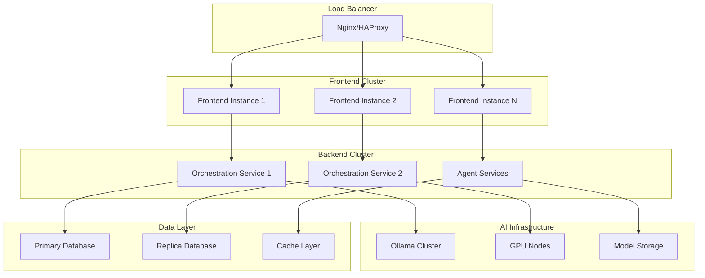

# 🏗️ AgentOS Studio Architecture Documentation

## System Architecture Overview

### High-Level Architecture

## Enhanced LLM Orchestration Workflow

### 5-Stage Orchestration Process

## LLM Reasoning Process

### 3-Stage LLM Analysis

## Service Communication Flow

### Inter-Service Communication

## Memory Management Architecture

### Stateless Session Design

## Data Flow Architecture

### Information Flow

## Security & Performance Architecture

### Security Layers

## Deployment Architecture

### Production Deployment

