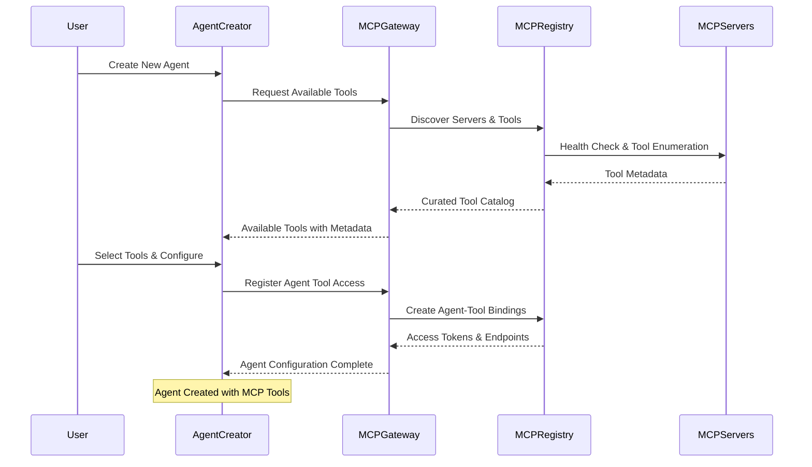
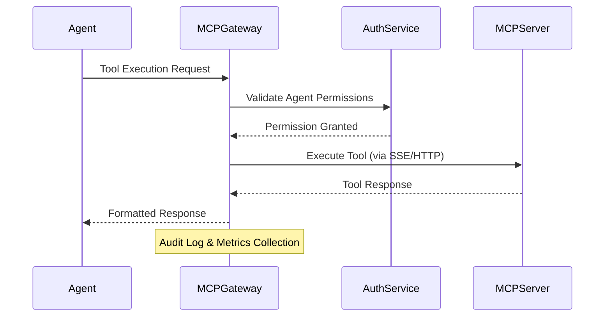

# MCP Gateway & Agent Creation Integration Design

## Overview

This document outlines the redesign of the current "MCP Dashboard" to "MCP Gateway" and its integration with the agent creation system, based on the MCP Gateway Registry architecture from the agentic-community repository.

## Architecture Changes

### 1. MCP Dashboard → MCP Gateway Transformation

**Current State:**
- Simple MCP Dashboard with basic server monitoring
- Local storage-based server management
- Limited tool discovery and selection

**New MCP Gateway:**
- Enterprise-ready gateway following MCP Gateway Registry patterns
- Centralized server registry with dynamic discovery
- Advanced authentication and authorization
- Tool catalog with semantic search
- Agent-to-MCP server orchestration

### 2. Core Components

#### A. MCP Gateway Registry Service
```typescript
interface MCPGatewayRegistry {
  // Server Management
  registerServer(server: MCPServerConfig): Promise<ServerRegistration>
  discoverServers(query?: string): Promise<MCPServer[]>
  getServerHealth(serverId: string): Promise<HealthStatus>
  
  // Tool Discovery
  searchTools(query: string, filters?: ToolFilters): Promise<MCPTool[]>
  getToolsByCategory(category: string): Promise<MCPTool[]>
  getToolMetadata(toolId: string): Promise<ToolMetadata>
  
  // Agent Integration
  getAgentCompatibleTools(agentType: string): Promise<MCPTool[]>
  validateToolAccess(agentId: string, toolId: string): Promise<boolean>
}
```

#### B. Enhanced MCP Server Model
```typescript
interface MCPServer {
  id: string
  name: string
  description: string
  url: string
  status: 'connected' | 'disconnected' | 'error' | 'testing'
  type: 'local' | 'remote' | 'aws' | 'gateway'
  
  // Gateway Registry Features
  transport: 'sse' | 'streamable-http' | 'auto'
  supportedTransports: string[]
  mcpEndpoint?: string
  sseEndpoint?: string
  
  // Authentication
  authentication: {
    type: 'none' | 'bearer' | 'oauth2' | 'cognito'
    config?: AuthConfig
  }
  
  // Tool Information
  tools: MCPTool[]
  toolCount: number
  categories: string[]
  tags: string[]
  
  // Registry Metadata
  stars: number
  license: string
  isPython: boolean
  lastHealthCheck?: Date
  
  // Agent Integration
  agentCompatibility: AgentCompatibility[]
  accessControl: AccessControlPolicy
}
```

#### C. Agent-MCP Integration Model
```typescript
interface AgentMCPIntegration {
  agentId: string
  selectedTools: {
    serverId: string
    toolId: string
    configuration?: ToolConfiguration
    permissions: ToolPermissions
  }[]
  
  // Dynamic Discovery
  enableDynamicDiscovery: boolean
  discoveryFilters: {
    categories: string[]
    maxTools: number
    trustLevel: 'verified' | 'community' | 'any'
  }
  
  // Gateway Configuration
  gatewayEndpoint: string
  authenticationMethod: 'agent-token' | 'oauth2' | 'cognito'
  
  // Monitoring
  usageMetrics: ToolUsageMetrics
  errorHandling: ErrorHandlingPolicy
}
```

### 3. Integration Flow

#### A. Agent Creation with MCP Tools


#### B. Runtime Agent-MCP Communication


### 4. Key Features Implementation

#### A. Dynamic Tool Discovery
- Semantic search across tool descriptions
- Category-based filtering
- Popularity and rating system
- Agent compatibility scoring

#### B. Enterprise Authentication
- OAuth 2.0/3.0 support
- AWS Cognito integration
- Fine-grained access control
- Token vending for agents

#### C. Gateway Orchestration
- Load balancing across MCP servers
- Health monitoring and failover
- Request routing and transformation
- Response caching and optimization

#### D. Agent Integration Points
- Tool selection during agent creation
- Runtime tool discovery and execution
- Permission management and auditing
- Usage analytics and optimization

### 5. Implementation Plan

#### Phase 1: Core Gateway Infrastructure
1. Rename MCPDashboard to MCPGateway
2. Implement server registry with database backend
3. Add authentication and authorization layer
4. Create tool discovery and search APIs

#### Phase 2: Agent Integration
1. Enhance agent creation with MCP tool selection
2. Implement agent-gateway communication protocol
3. Add runtime tool discovery capabilities
4. Create agent permission management

#### Phase 3: Enterprise Features
1. Add OAuth 2.0/3.0 authentication
2. Implement fine-grained access control
3. Add usage analytics and monitoring
4. Create admin dashboard for governance

#### Phase 4: Advanced Capabilities
1. Implement semantic tool search
2. Add tool recommendation engine
3. Create agent-tool compatibility scoring
4. Add automated tool testing and validation

## Benefits

### For Developers
- Single configuration point for all MCP tools
- Dynamic tool discovery during development
- Centralized authentication and permissions
- Rich tool catalog with metadata and ratings

### For Agents
- Runtime tool discovery and execution
- Secure, governed access to enterprise tools
- Automatic failover and load balancing
- Comprehensive audit trail

### For Organizations
- Centralized governance and compliance
- Usage analytics and cost optimization
- Security and access control
- Tool lifecycle management

## Next Steps

1. Review and approve this design
2. Begin Phase 1 implementation
3. Create detailed technical specifications
4. Set up development and testing environments
5. Plan migration strategy for existing MCP configurations