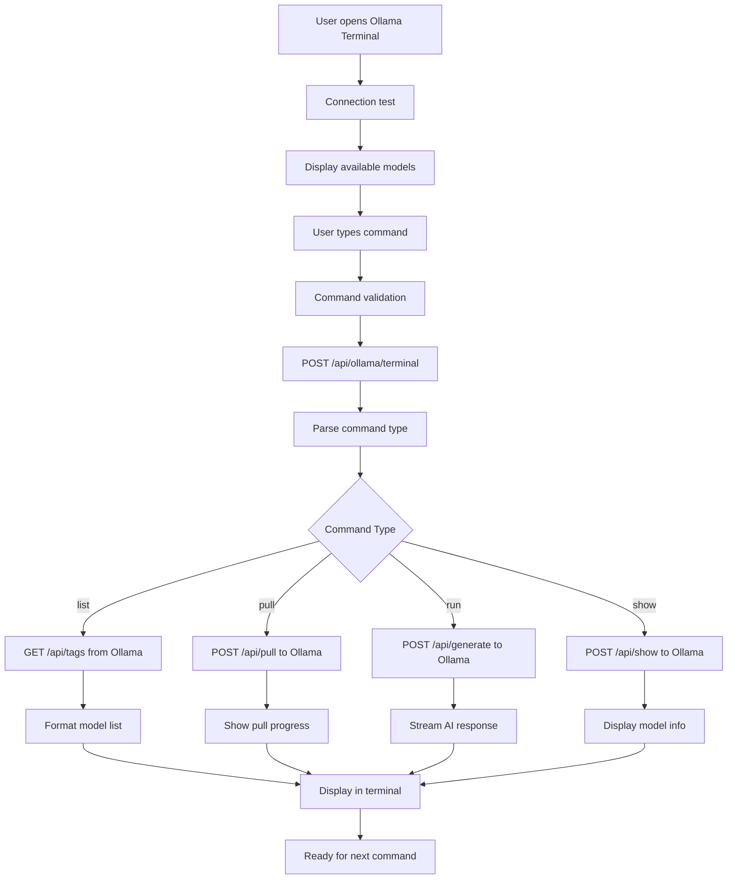
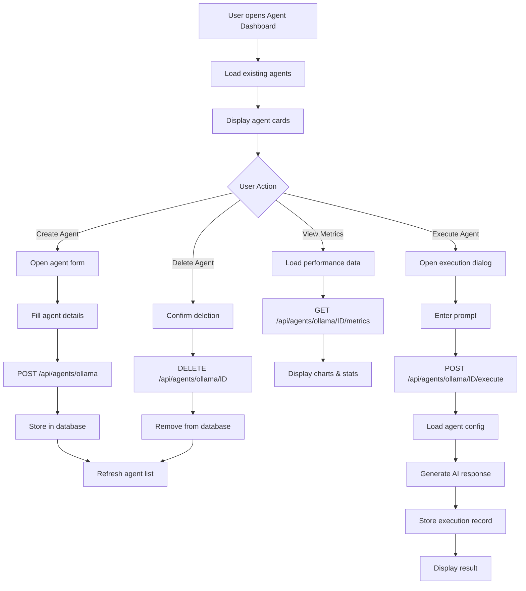
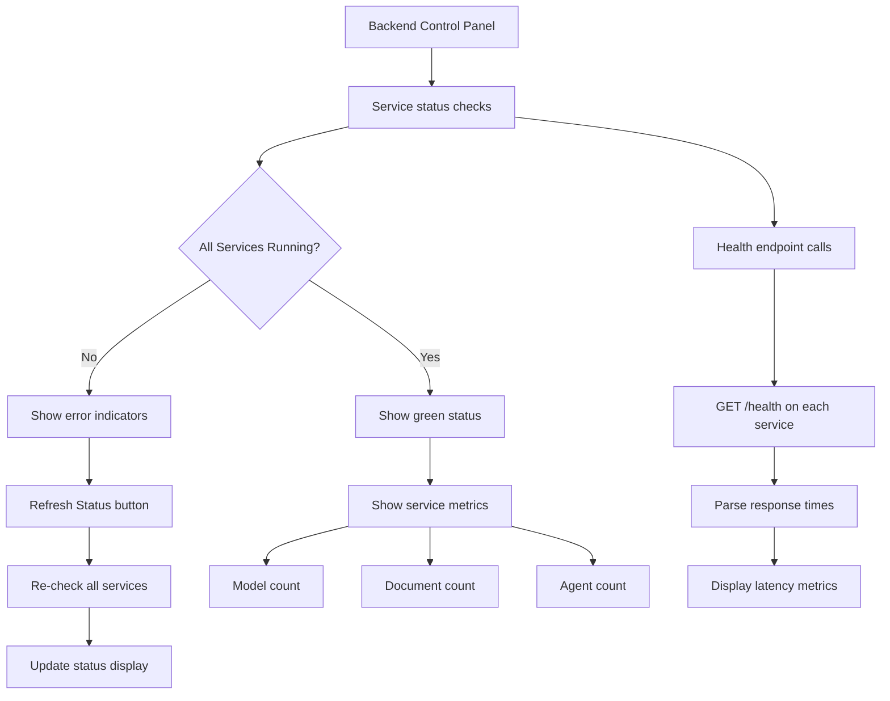

# Welcome to AshRepo - AI Agent Platform

## Project info

**Repository**: AshRepo AI Agent Platform  
**Description**: Advanced multi-industry AI agent management platform

## How can I edit this code?

There are several ways of editing your application.

**Use your preferred IDE**

You can clone this repo and push changes directly.

The only requirement is having Node.js & npm installed - [install with nvm](https://github.com/nvm-sh/nvm#installing-and-updating)

Follow these steps:

```sh
# Step 1: Clone the repository using the project's Git URL.
git clone https://github.com/ashfrnndz21/AgentOS_StudioV2.git

# Step 2: Navigate to the project directory.
cd AgentOS_StudioV2

# Step 3: Install the necessary dependencies.
npm i

# Step 4: Set up Python backend environment
python3 -m venv backend/venv
source backend/venv/bin/activate  # On Windows: backend\venv\Scripts\activate
pip install -r backend/requirements.txt

# Step 5: Install and start Ollama (for AI models)
# Download from https://ollama.ai and run:
ollama serve

# Step 6: Start the complete application (frontend + backend)
./manage-app.sh start
```

## 🚀 Quick Start with Automation Scripts

We've included powerful automation scripts for easy application management:

### **Master Control Script**
```bash
./manage-app.sh [command]
```

**Available Commands:**
- `start` - Start all services (frontend + backend)
- `stop` - Stop all services  
- `restart` - Restart all services
- `status` - Check status of all services
- `help` - Show help information

### **Individual Scripts**
```bash
# Start all services with health checks
./start-all-services.sh

# Stop all services cleanly
./kill-all-services.sh
```

### **Service Architecture**
The application runs multiple services:
- **Frontend (Vite)**: `http://localhost:5173` - React/TypeScript UI
- **Ollama API**: `http://localhost:5002` - AI model management & terminal
- **RAG API**: `http://localhost:5003` - Document chat with AI
- **Ollama Core**: `http://localhost:11434` - AI model service

## 🧠 Strands Intelligence Workspace

The platform now includes an advanced **Strands-inspired multi-agent workflow system** with intelligent orchestration capabilities:

### **Key Features**
- **🔄 Strands Reasoning Patterns**: Sequential, parallel, and conditional task execution
- **🤖 Local Ollama Integration**: Privacy-focused AI processing with dynamic model selection
- **🛠️ Smart Tools**: Calculator, time, counter, Python REPL, and web search capabilities
- **🎯 Auto-Orchestration**: Intelligent dependency resolution and workflow management
- **📊 Real-time Monitoring**: Live execution status and performance metrics

### **How to Use Strands Workspace**
1. Navigate to **Multi-Agent Workspace** in the application
2. Select **"Strands Intelligence Workspace"** from the project templates
3. Use the **Agent Palette** to browse and select Ollama-powered agents
4. **Drag & Drop** agents onto the workflow canvas
5. **Connect nodes** to define task dependencies and data flow
6. **Configure agents** with custom prompts, reasoning patterns, and tools
7. **Execute workflows** and monitor real-time progress

### **Strands Tools Available**
- **Calculator**: Mathematical expressions and computations
- **Current Time**: Date/time information with timezone support
- **Letter Counter**: Text analysis and character counting
- **Python REPL**: Code execution environment (development mode)
- **Web Search**: Information retrieval capabilities (development mode)

### **Supported Reasoning Patterns**
- **Sequential**: Step-by-step task execution with dependency chains
- **Parallel**: Multi-threaded agent coordination for concurrent processing
- **Conditional**: Context-aware decision making with branching logic

### **Prerequisites**
- **Node.js & npm** - [Install with nvm](https://github.com/nvm-sh/nvm#installing-and-updating)
- **Python 3.8+** - For backend services
- **Ollama** - [Download from ollama.ai](https://ollama.ai)

### **Manual Setup (Alternative)**
If you prefer manual setup:

**Edit a file directly in GitHub**

- Navigate to the desired file(s).
- Click the "Edit" button (pencil icon) at the top right of the file view.
- Make your changes and commit the changes.

**Use GitHub Codespaces**

- Navigate to the main page of your repository.
- Click on the "Code" button (green button) near the top right.
- Select the "Codespaces" tab.
- Click on "New codespace" to launch a new Codespace environment.
- Edit files directly within the Codespace and commit and push your changes once you're done.

## What technologies are used for this project?

This project is built with:

- Vite
- TypeScript
- React
- shadcn-ui
- Tailwind CSS

## How can I deploy this project?

This project can be deployed using various methods:

- **Vercel**: Connect your GitHub repository to Vercel for automatic deployments
- **Netlify**: Deploy directly from your Git repository
- **Docker**: Use the included Docker configurations for containerized deployment
- **Traditional hosting**: Build the project and serve the static files

## 🎯 Features

### **AI & Document Processing**
- **Ollama Integration**: Local AI model management and execution
- **Document Chat**: Upload and chat with documents using RAG (Retrieval Augmented Generation)
- **AI Terminal**: Interactive terminal for Ollama commands
- **Model Management**: Pull, delete, and manage AI models

### **Agent Management**
- **Multi-Agent Support**: Create and manage multiple AI agents
- **Agent Execution**: Run agents with custom prompts and configurations
- **Performance Metrics**: Track agent performance and usage statistics
- **Agent Persistence**: SQLite database for agent storage

### **Platform Features**
- **Multi-Industry Support**: Banking, Telco, Healthcare agent platforms
- **Real-time Monitoring**: Live agent performance tracking
- **Customizable Branding**: Logo and theme customization
- **Advanced Workflows**: Multi-agent orchestration capabilities
- **Backend Integration**: Full API integration with monitoring

### **Developer Experience**
- **Automated Service Management**: One-command startup/shutdown
- **Health Monitoring**: Automatic service health checks
- **Port Conflict Prevention**: Smart port management
- **Error Recovery**: Robust error handling and recovery
- **Development Tools**: Hot reload, debugging, and logging

## 🛠️ Troubleshooting

### **Common Issues**

**Port conflicts:**
```bash
# Clean all services and restart
./manage-app.sh restart
```

**Services not starting:**
```bash
# Check service status
./manage-app.sh status

# View detailed logs
./manage-app.sh logs
```

**Ollama not found:**
```bash
# Install Ollama from https://ollama.ai
# Then start it:
ollama serve
```

**Python dependencies:**
```bash
# Reinstall Python dependencies
source backend/venv/bin/activate
pip install -r backend/requirements.txt
```

### **Service URLs**
- **Application**: http://localhost:5173
- **Ollama API**: http://localhost:5002/health
- **RAG API**: http://localhost:5003/health
- **Ollama Core**: http://localhost:11434/api/tags

## 📋 Automation Scripts Documentation

### **manage-app.sh** - Master Control
The main application management script with comprehensive service control:

```bash
# Start everything
./manage-app.sh start

# Stop everything  
./manage-app.sh stop

# Restart all services
./manage-app.sh restart

# Check what's running
./manage-app.sh status

# Show help
./manage-app.sh help
```

### **start-all-services.sh** - Intelligent Startup
Comprehensive startup script with:
- ✅ Dependency verification (Node.js, Python, Ollama)
- ✅ Port conflict prevention
- ✅ Service health checks
- ✅ Proper startup sequencing
- ✅ Error handling and recovery

### **kill-all-services.sh** - Clean Shutdown
Robust service termination:
- ✅ Kills processes by port (most reliable)
- ✅ Kills processes by name pattern (backup)
- ✅ Verifies all ports are freed
- ✅ Handles stuck processes

### **Service Management Best Practices**
1. **Always use the automation scripts** - They handle edge cases and conflicts
2. **Check status before starting** - `./manage-app.sh status`
3. **Use restart for updates** - `./manage-app.sh restart`
4. **Monitor logs for issues** - `./manage-app.sh logs`

## 🔧 Development Workflow

### **Daily Development**
```bash
# Start your development session
./manage-app.sh start

# Check everything is running
./manage-app.sh status

# Make your changes...

# Restart if needed
./manage-app.sh restart

# End your session
./manage-app.sh stop
```

### **Contributing**
1. Fork the repository
2. Create a feature branch
3. Use the automation scripts for testing
4. Submit a pull request

## 📚 Technical Architecture & Design

### **System Overview**
AgentOS Studio is a comprehensive AI agent platform built with a microservices architecture, featuring a React frontend and multiple Python backend services for AI model management, document processing, and agent orchestration.

```
┌─────────────────┐    ┌─────────────────┐    ┌─────────────────┐
│   Frontend      │    │   Ollama API    │    │   RAG API       │
│   (React/Vite)  │◄──►│   (Flask)       │    │   (FastAPI)     │
│   Port 5173     │    │   Port 5002     │    │   Port 5003     │
└─────────────────┘    └─────────────────┘    └─────────────────┘
         │                       │                       │
         │                       ▼                       ▼
         │              ┌─────────────────┐    ┌─────────────────┐
         │              │   SQLite DB     │    │   ChromaDB      │
         │              │   (Agents)      │    │   (Vectors)     │
         │              └─────────────────┘    └─────────────────┘
         │
         ▼
┌─────────────────┐
│   Ollama Core   │
│   (AI Models)   │
│   Port 11434    │
└─────────────────┘
```

### **Component Architecture**

#### **1. Frontend Layer (React/TypeScript)**
- **Framework**: Vite + React 18 + TypeScript
- **UI Components**: shadcn-ui + Tailwind CSS + Lucide Icons
- **State Management**: React Context + Custom Hooks
- **Routing**: React Router v6
- **API Communication**: Custom API client with error handling
- **Real-time Updates**: Polling-based status updates

**Key Components:**
- `OllamaTerminal.tsx` - Interactive AI model terminal
- `DocumentChat.tsx` - Document upload and chat interface
- `AgentDashboard.tsx` - Agent management and monitoring
- `BackendControl.tsx` - Service status and control panel

#### **2. Ollama API Service (Flask)**
**File**: `backend/ollama_api.py`
**Purpose**: AI model management, agent orchestration, and terminal interface

**Core Responsibilities:**
- AI model lifecycle management (pull, delete, list)
- Agent creation, execution, and monitoring
- Terminal command processing for Ollama
- Performance metrics and analytics
- SQLite database management for agents

**Key Endpoints:**
```python
# Model Management
GET  /api/ollama/models          # List available models
GET  /api/ollama/status          # Check Ollama service status
POST /api/ollama/pull            # Pull new models
DELETE /api/ollama/delete        # Delete models

# Agent Management  
POST /api/agents/ollama          # Create new agent
GET  /api/agents/ollama          # List all agents
DELETE /api/agents/ollama/<id>   # Delete agent
POST /api/agents/ollama/<id>/execute  # Execute agent

# Terminal Interface
POST /api/ollama/terminal        # Process terminal commands
POST /api/ollama/generate        # Generate AI responses

# Monitoring
GET  /api/agents/ollama/<id>/metrics  # Agent performance metrics
GET  /health                     # Service health check
```

#### **3. RAG API Service (FastAPI)**
**File**: `backend/rag_api.py`
**Purpose**: Document processing, vector storage, and retrieval-augmented generation

**Core Responsibilities:**
- Document ingestion (PDF, TXT, MD)
- Text chunking and embedding generation
- Vector database management (ChromaDB)
- Semantic search and retrieval
- RAG-based question answering

**Key Endpoints:**
```python
# Document Management
POST /api/rag/ingest            # Upload and process documents
GET  /api/rag/documents         # List processed documents
DELETE /api/rag/documents/<id>  # Delete document

# Query Interface
POST /api/rag/query             # Query documents with AI
GET  /api/rag/status            # Service health and stats

# Administration
POST /api/rag/clear             # Clear all documents
GET  /health                    # Service health check
```

#### **4. Ollama Core Service**
**Purpose**: Local AI model execution engine
**Technology**: Ollama (Go-based AI runtime)
**Models Supported**: Llama, Mistral, Phi, CodeLlama, Qwen, etc.

**Core Functions:**
- Model loading and unloading
- Inference execution
- Model parameter management
- GPU/CPU optimization

### **Database Design**

#### **Agents Database (SQLite)**
```sql
-- Agents table
CREATE TABLE agents (
    id TEXT PRIMARY KEY,
    name TEXT NOT NULL,
    role TEXT,
    description TEXT,
    model TEXT NOT NULL,
    personality TEXT,
    expertise TEXT,
    system_prompt TEXT,
    temperature REAL DEFAULT 0.7,
    max_tokens INTEGER DEFAULT 1000,
    guardrails_enabled BOOLEAN DEFAULT FALSE,
    safety_level TEXT DEFAULT 'medium',
    content_filters TEXT,
    custom_rules TEXT,
    created_at TIMESTAMP DEFAULT CURRENT_TIMESTAMP,
    updated_at TIMESTAMP DEFAULT CURRENT_TIMESTAMP
);

-- Conversations table
CREATE TABLE conversations (
    id TEXT PRIMARY KEY,
    agent_id TEXT NOT NULL,
    messages TEXT,
    created_at TIMESTAMP DEFAULT CURRENT_TIMESTAMP,
    FOREIGN KEY (agent_id) REFERENCES agents (id)
);

-- Executions table
CREATE TABLE executions (
    id TEXT PRIMARY KEY,
    agent_id TEXT NOT NULL,
    input_text TEXT NOT NULL,
    output_text TEXT,
    success BOOLEAN DEFAULT FALSE,
    duration INTEGER,
    tokens_used INTEGER,
    error_message TEXT,
    timestamp TIMESTAMP DEFAULT CURRENT_TIMESTAMP,
    FOREIGN KEY (agent_id) REFERENCES agents (id)
);
```

#### **RAG Database (SQLite + ChromaDB)**
```sql
-- Documents table
CREATE TABLE documents (
    id TEXT PRIMARY KEY,
    filename TEXT NOT NULL,
    content_type TEXT,
    file_size INTEGER,
    chunk_count INTEGER DEFAULT 0,
    upload_timestamp TIMESTAMP DEFAULT CURRENT_TIMESTAMP,
    processing_status TEXT DEFAULT 'pending'
);

-- Document chunks table  
CREATE TABLE document_chunks (
    id TEXT PRIMARY KEY,
    document_id TEXT NOT NULL,
    chunk_index INTEGER,
    content TEXT NOT NULL,
    embedding_id TEXT,
    created_at TIMESTAMP DEFAULT CURRENT_TIMESTAMP,
    FOREIGN KEY (document_id) REFERENCES documents (id)
);
```

## 🔄 User Interaction Workflows

### **Workflow 1: Document Chat Experience**

```mermaid
graph TD
    A[User opens Document Chat] --> B[Upload Document]
    B --> C[Frontend: File validation]
    C --> D[POST /api/rag/ingest]
    D --> E[RAG API: Process document]
    E --> F[Text extraction & chunking]
    F --> G[Generate embeddings]
    G --> H[Store in ChromaDB]
    H --> I[Update document status]
    I --> J[User sees "Ready to chat"]
    J --> K[User asks question]
    K --> L[POST /api/rag/query]
    L --> M[Semantic search in vectors]
    M --> N[Retrieve relevant chunks]
    N --> O[Generate context prompt]
    O --> P[Call Ollama for response]
    P --> Q[Return AI answer with sources]
    Q --> R[Display in chat interface]
```

**User Journey:**
1. **Upload Phase**: User drags/drops document → File validation → Processing indicator
2. **Processing Phase**: Document chunking → Embedding generation → Vector storage
3. **Chat Phase**: Question input → Semantic search → AI response with citations
4. **Management Phase**: View documents → Delete documents → Clear all

### **Workflow 2: Ollama Terminal Experience**



**User Journey:**
1. **Connection Phase**: Auto-connect to backend → Test Ollama service → Show status
2. **Command Phase**: Type command → Syntax validation → Execute → Show results
3. **Model Management**: List models → Pull new models → Show model details
4. **AI Interaction**: Run model with prompt → Stream response → Continue conversation

### **Workflow 3: Agent Management Experience**



**User Journey:**
1. **Discovery Phase**: View agent gallery → Browse by category → Check performance
2. **Creation Phase**: Define agent role → Set parameters → Configure guardrails
3. **Execution Phase**: Select agent → Input prompt → Review response → Save results
4. **Management Phase**: Monitor performance → Update configurations → Archive agents

### **Workflow 4: System Monitoring & Control**



**User Journey:**
1. **Status Monitoring**: Auto-refresh service status → Show health indicators → Display metrics
2. **Troubleshooting**: Identify failed services → Show error messages → Provide restart guidance
3. **Performance Tracking**: Monitor response times → Track resource usage → Show capacity metrics

## 🎯 Component Interaction Patterns

### **Frontend-Backend Communication**
- **API Client Pattern**: Centralized HTTP client with error handling
- **Polling Strategy**: Regular status updates every 30 seconds
- **Error Recovery**: Automatic retry with exponential backoff
- **Loading States**: Progressive loading indicators for better UX

### **Service-to-Service Communication**
- **Ollama API ↔ Ollama Core**: Direct HTTP calls for model operations
- **RAG API ↔ Ollama Core**: AI generation for document queries
- **Frontend ↔ Multiple APIs**: Parallel requests with Promise.all()

### **Data Flow Patterns**
- **Document Processing**: Upload → Chunk → Embed → Store → Index
- **Agent Execution**: Load → Configure → Execute → Store → Report
- **Terminal Commands**: Parse → Validate → Execute → Format → Display

### **Error Handling Strategy**
- **Frontend**: Toast notifications + retry mechanisms
- **Backend**: Structured error responses + logging
- **Database**: Transaction rollbacks + data integrity checks
- **AI Services**: Timeout handling + fallback responses

## 🚀 Deployment & Scaling

### **Development Environment**
```bash
# Local development with hot reload
./manage-app.sh start
```

### **Production Deployment Options**

#### **Option 1: Docker Containerization**
```dockerfile
# Frontend Container
FROM node:18-alpine
WORKDIR /app
COPY package*.json ./
RUN npm ci --only=production
COPY . .
RUN npm run build
EXPOSE 5173

# Backend Container  
FROM python:3.11-slim
WORKDIR /app
COPY backend/requirements.txt .
RUN pip install -r requirements.txt
COPY backend/ .
EXPOSE 5002 5003
```

#### **Option 2: Cloud Deployment**
- **Frontend**: Vercel, Netlify, or AWS S3 + CloudFront
- **Backend APIs**: AWS ECS, Google Cloud Run, or DigitalOcean App Platform
- **Ollama Service**: GPU-enabled instances (AWS p3, GCP A100)
- **Database**: AWS RDS, Google Cloud SQL, or managed SQLite

#### **Option 3: Self-Hosted**
- **Reverse Proxy**: Nginx or Apache
- **Process Management**: PM2 or systemd
- **SSL Termination**: Let's Encrypt + Certbot
- **Monitoring**: Prometheus + Grafana

### **Scaling Considerations**

#### **Horizontal Scaling**
- **Load Balancer**: Distribute requests across multiple backend instances
- **Database Sharding**: Partition agents and documents by tenant/user
- **Model Caching**: Redis for frequently used model responses
- **CDN**: Static asset delivery for global performance

#### **Vertical Scaling**
- **GPU Acceleration**: NVIDIA GPUs for faster model inference
- **Memory Optimization**: Increase RAM for larger models and document processing
- **SSD Storage**: Fast storage for vector databases and model files

#### **Performance Optimization**
- **Model Quantization**: Use smaller model variants (Q4, Q8)
- **Batch Processing**: Group document processing requests
- **Connection Pooling**: Reuse database connections
- **Caching Strategy**: Cache embeddings and frequent queries

## 🔒 Security & Privacy

### **Data Protection**
- **Local Processing**: All AI inference happens locally (no data sent to external APIs)
- **Document Encryption**: Encrypt documents at rest in SQLite
- **Session Management**: Secure session handling with JWT tokens
- **Input Validation**: Sanitize all user inputs to prevent injection attacks

### **Access Control**
- **Authentication**: User login system (optional)
- **Authorization**: Role-based access to agents and documents
- **API Security**: Rate limiting and request validation
- **Audit Logging**: Track all user actions and system events

### **Privacy Features**
- **Data Retention**: Configurable document and conversation retention policies
- **Data Export**: Allow users to export their data
- **Data Deletion**: Complete data removal on user request
- **Anonymization**: Remove PII from logs and analytics

## 📊 Monitoring & Analytics

### **System Metrics**
- **Service Health**: Uptime, response times, error rates
- **Resource Usage**: CPU, memory, disk, GPU utilization
- **Model Performance**: Inference speed, token throughput
- **Database Metrics**: Query performance, storage usage

### **User Analytics**
- **Usage Patterns**: Most used features, peak usage times
- **Performance Metrics**: User satisfaction, task completion rates
- **Error Tracking**: User-facing errors and resolution times
- **Feature Adoption**: New feature usage and feedback

### **Business Intelligence**
- **Agent Effectiveness**: Success rates, user ratings
- **Document Processing**: Processing times, accuracy metrics
- **Cost Analysis**: Resource costs per user/operation
- **Growth Metrics**: User acquisition, retention, engagement

## 🧪 Testing Strategy

### **Frontend Testing**
- **Unit Tests**: Jest + React Testing Library
- **Integration Tests**: Cypress for E2E workflows
- **Visual Testing**: Storybook for component documentation
- **Performance Testing**: Lighthouse for web vitals

### **Backend Testing**
- **Unit Tests**: pytest for individual functions
- **API Tests**: FastAPI TestClient for endpoint testing
- **Integration Tests**: Test database operations and AI model calls
- **Load Testing**: Artillery or Locust for performance testing

### **AI Model Testing**
- **Response Quality**: Automated evaluation of AI responses
- **Performance Benchmarks**: Inference speed and accuracy tests
- **Regression Testing**: Ensure model updates don't break functionality
- **Safety Testing**: Test guardrails and content filtering

## 🔧 Configuration Management

### **Environment Variables**
```bash
# Frontend Configuration
VITE_API_BASE_URL=http://localhost:5002
VITE_RAG_API_URL=http://localhost:5003
VITE_OLLAMA_URL=http://localhost:11434

# Backend Configuration
OLLAMA_BASE_URL=http://localhost:11434
DATABASE_PATH=./ollama_agents.db
RAG_DATABASE_PATH=./rag_documents.db
LOG_LEVEL=INFO

# AI Model Configuration
DEFAULT_MODEL=llama3.2
MAX_TOKENS=2000
TEMPERATURE=0.7
CONTEXT_WINDOW=4096
```

### **Feature Flags**
- **Document Upload**: Enable/disable document processing
- **Agent Creation**: Control agent creation permissions
- **Model Management**: Restrict model pull/delete operations
- **Debug Mode**: Enable detailed logging and error reporting

## 📈 Roadmap & Future Enhancements

### **Short Term (Next 3 months)**
- [ ] Multi-user support with authentication
- [ ] Advanced agent templates and presets
- [ ] Real-time collaboration on documents
- [ ] Mobile-responsive design improvements

### **Medium Term (3-6 months)**
- [ ] Plugin system for custom integrations
- [ ] Advanced analytics dashboard
- [ ] Multi-language support
- [ ] Voice interaction capabilities

### **Long Term (6+ months)**
- [ ] Distributed deployment across multiple nodes
- [ ] Advanced AI model fine-tuning
- [ ] Enterprise SSO integration
- [ ] Advanced workflow automation

## 🤝 Contributing Guidelines

### **Development Setup**
1. Fork the repository
2. Create a feature branch: `git checkout -b feature/amazing-feature`
3. Set up development environment: `./manage-app.sh start`
4. Make your changes and test thoroughly
5. Commit with conventional commits: `git commit -m "feat: add amazing feature"`
6. Push to your fork: `git push origin feature/amazing-feature`
7. Create a Pull Request

### **Code Standards**
- **Frontend**: ESLint + Prettier for TypeScript/React
- **Backend**: Black + isort for Python formatting
- **Documentation**: Update README for any architectural changes
- **Testing**: Maintain test coverage above 80%

### **Review Process**
- All PRs require review from maintainers
- Automated tests must pass
- Documentation must be updated
- Performance impact must be assessed
