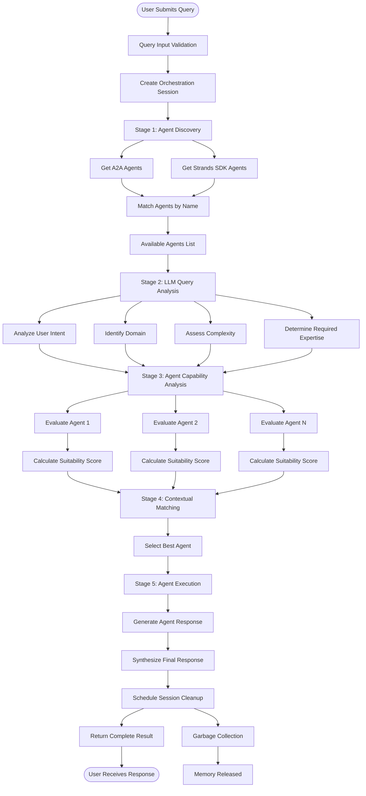
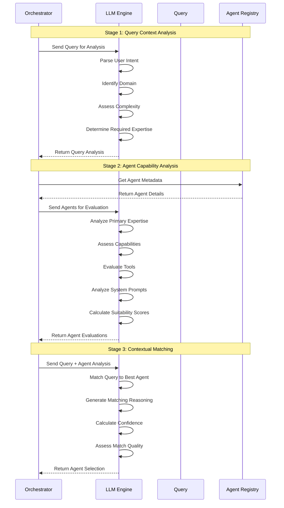
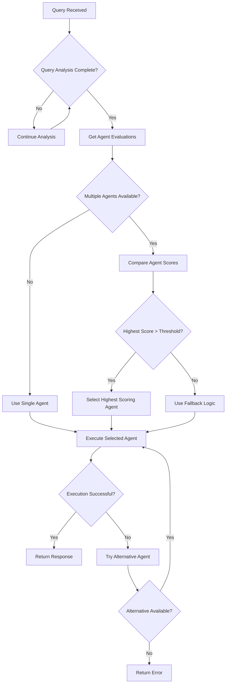
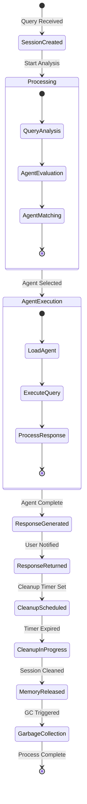
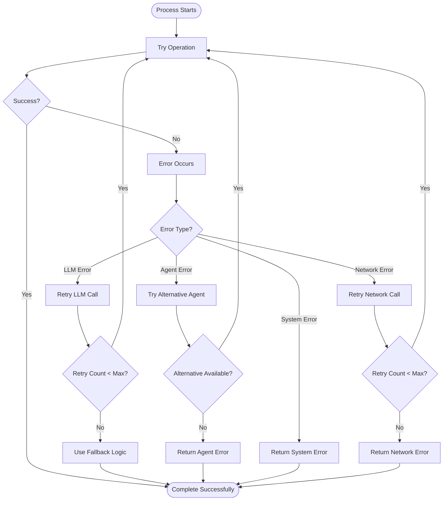
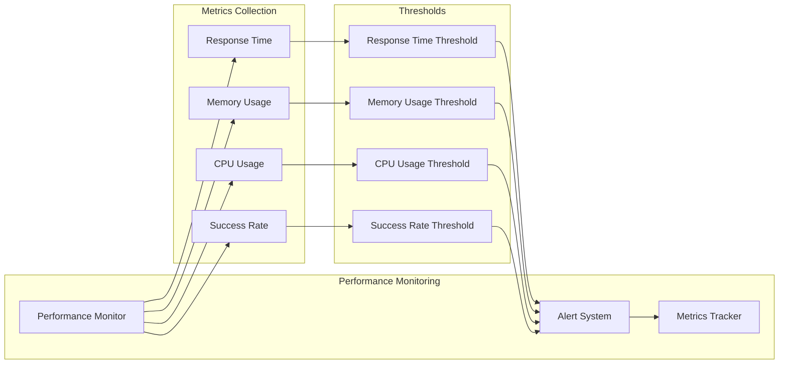
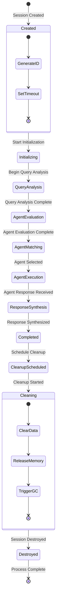
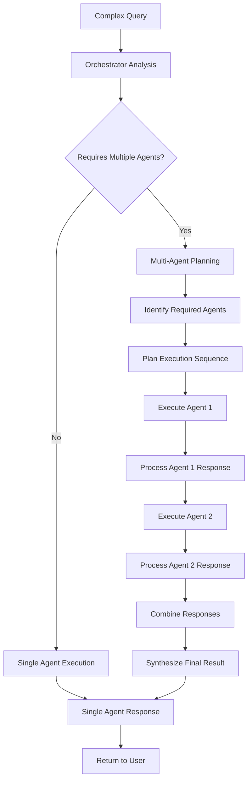
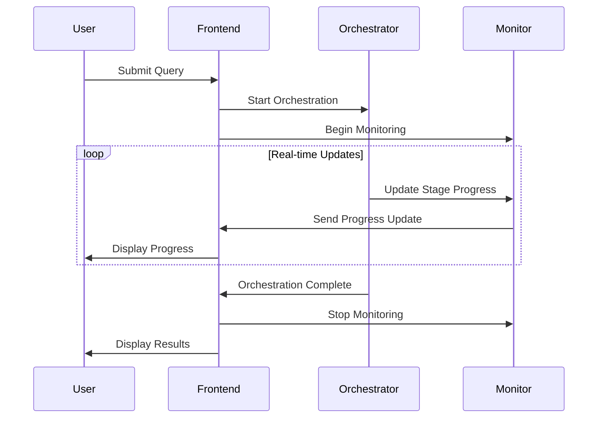

# 🔄 AgentOS Studio Workflow Documentation

## Enhanced LLM Orchestration Workflows

### Complete Orchestration Workflow

### LLM Analysis Workflow

### Agent Selection Decision Tree

### Memory Management Workflow

### Error Handling Workflow

### Performance Monitoring Workflow

### Session Lifecycle Workflow

### Multi-Agent Collaboration Workflow

### Real-time Monitoring Workflow

