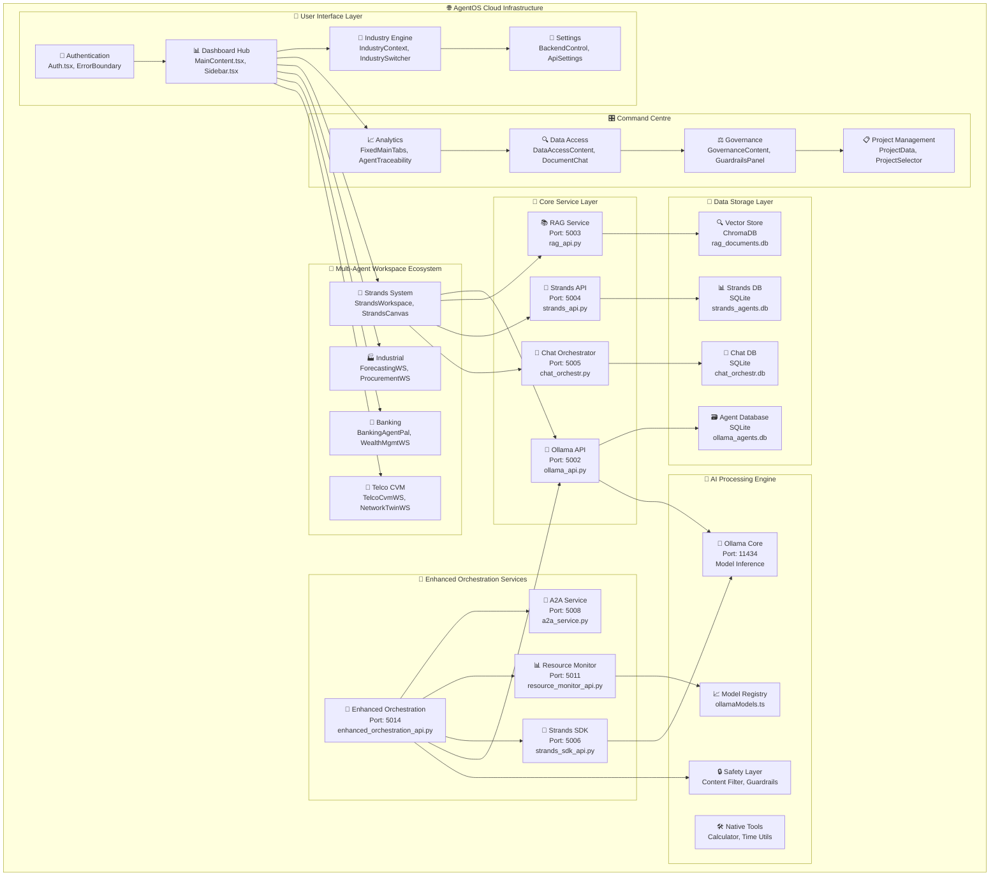
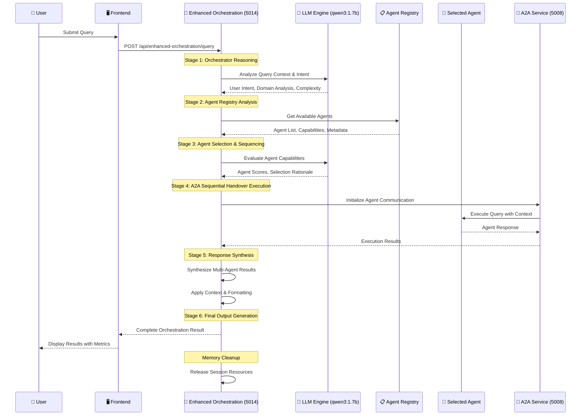
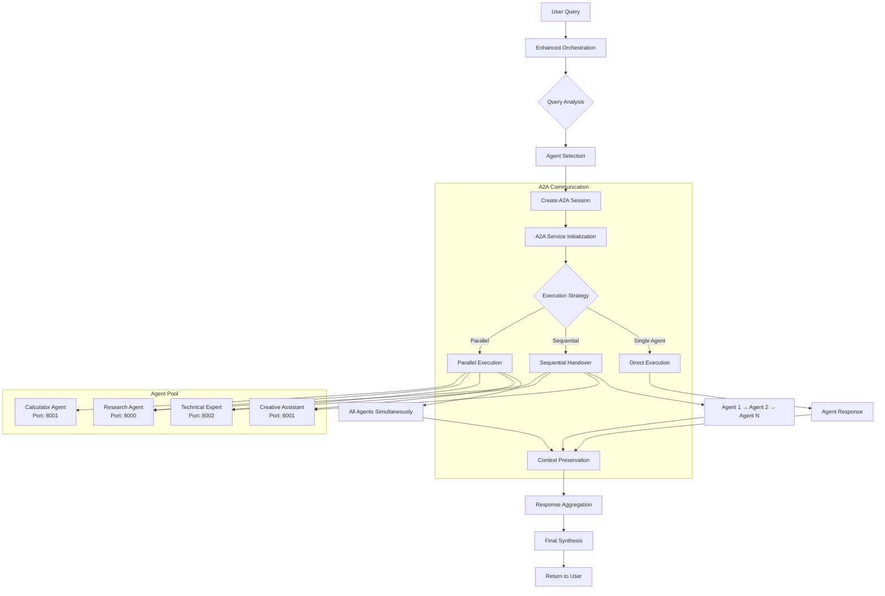
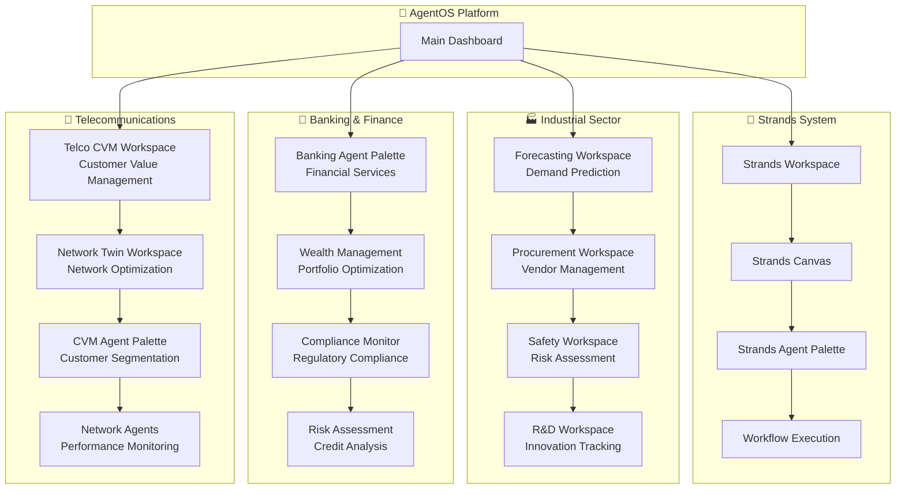
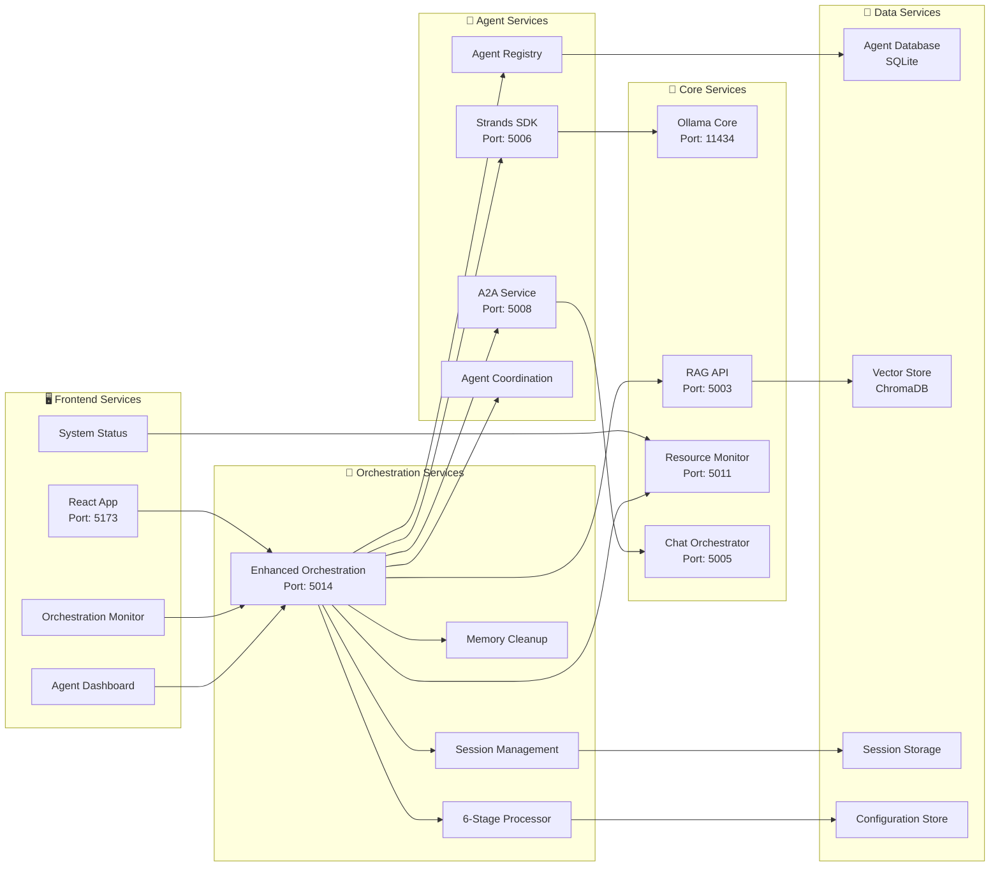
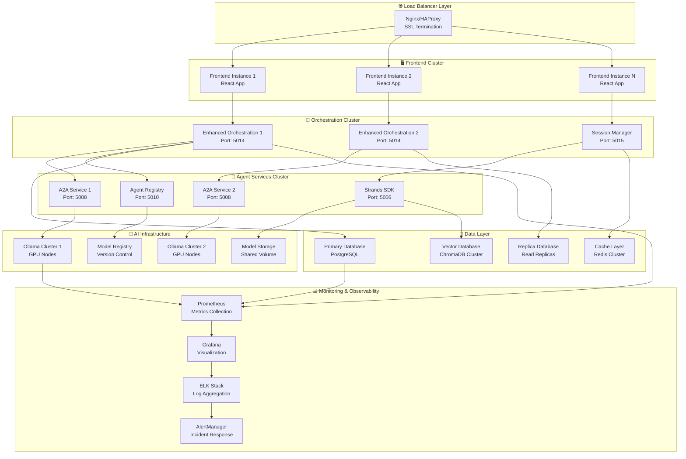
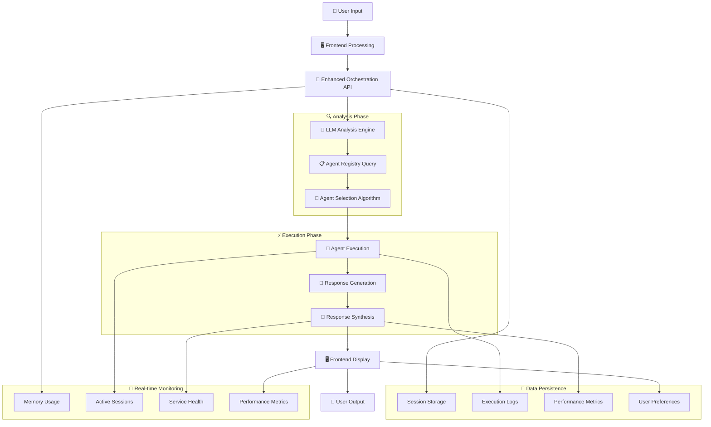
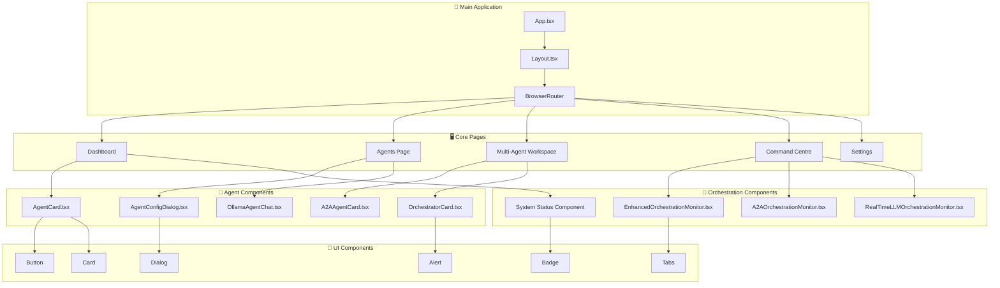

# 🏗️ AgentOS Architecture Diagrams

## Overview

This document contains comprehensive architecture diagrams for the AgentOS multi-agent orchestration platform, showcasing the complete system design, data flow, and service interactions.

---

## 1. 🌐 System Architecture Overview

### Complete Service Orchestration Architecture



---

## 2. 🔄 Enhanced Orchestration Workflow

### 6-Stage Multi-Agent Orchestration Process



---

## 3. 🧠 A2A Communication Flow

### Agent-to-Agent Handover Process



---

## 4. 📊 Real-Time System Monitoring

### Live Metrics and Health Monitoring

```mermaid
graph LR
    subgraph "🔍 Monitoring Dashboard"
        MEM[💾 Memory Usage<br/>74.8% (3.47GB/8.0GB)]
        SESS[👥 Active Sessions<br/>0 sessions]
        MODEL[🤖 Model Status<br/>qwen3:1.7b]
        HEALTH[❤️ Service Health<br/>All Systems Green]
    end
    
    subgraph "📊 Resource Monitor (5011)"
        CPU[🖥️ CPU Usage<br/>10.9%]
        DISK[💿 Disk Usage<br/>2.91%]
        SWAP[🔄 Swap Usage<br/>4.06GB/5.0GB]
        LOAD[⚡ Load Average<br/>3.21, 2.76, 2.49]
    end
    
    subgraph "🔧 Service Health Checks"
        OLLAMA_H[🦙 Ollama API<br/>Port: 5002 ✅]
        RAG_H[📚 RAG Service<br/>Port: 5003 ✅]
        STRANDS_H[🔗 Strands API<br/>Port: 5004 ✅]
        CHAT_H[💬 Chat Orchestrator<br/>Port: 5005 ✅]
        A2A_H[🧠 A2A Service<br/>Port: 5008 ✅]
        RESOURCE_H[📊 Resource Monitor<br/>Port: 5011 ✅]
        ENHANCED_H[🔄 Enhanced Orchestration<br/>Port: 5014 ✅]
        SDK_H[🎯 Strands SDK<br/>Port: 5006 ✅]
    end
    
    MEM --> CPU
    SESS --> HEALTH
    MODEL --> OLLAMA_H
    
    HEALTH --> OLLAMA_H
    HEALTH --> RAG_H
    HEALTH --> STRANDS_H
    HEALTH --> CHAT_H
    HEALTH --> A2A_H
    HEALTH --> RESOURCE_H
    HEALTH --> ENHANCED_H
    HEALTH --> SDK_H
```

---

## 5. 🏭 Industry-Specific Workspaces

### Multi-Industry Agent Ecosystem



---

## 6. 🔧 Service Communication Architecture

### Inter-Service Communication Flow



---

## 7. 🔒 Security & Performance Architecture

### Multi-Layer Security and Performance

```mermaid
graph TB
    subgraph "🛡️ Security Layers"
        SL1[Input Validation<br/>Request Sanitization]
        SL2[Authentication<br/>User Verification]
        SL3[Authorization<br/>Role-based Access]
        SL4[Rate Limiting<br/>API Throttling]
        SL5[Data Encryption<br/>TLS/SSL]
        SL6[Content Filtering<br/>Safety Guardrails]
    end
    
    subgraph "⚡ Performance Layers"
        PL1[Caching Layer<br/>Response Caching]
        PL2[Load Balancing<br/>Request Distribution]
        PL3[Memory Management<br/>Resource Optimization]
        PL4[Resource Monitoring<br/>Real-time Metrics]
        PL5[Session Management<br/>Stateless Design]
        PL6[Auto-scaling<br/>Dynamic Resources]
    end
    
    subgraph "🔍 Monitoring & Analytics"
        MA1[Health Checks<br/>Service Status]
        MA2[Performance Metrics<br/>Response Times]
        MA3[Error Tracking<br/>Exception Handling]
        MA4[Audit Logging<br/>Activity Tracking]
        MA5[Usage Analytics<br/>User Behavior]
        MA6[System Alerts<br/>Proactive Monitoring]
    end
    
    SL1 --> SL2
    SL2 --> SL3
    SL3 --> SL4
    SL4 --> SL5
    SL5 --> SL6
    
    PL1 --> PL2
    PL2 --> PL3
    PL3 --> PL4
    PL4 --> PL5
    PL5 --> PL6
    
    MA1 --> MA2
    MA2 --> MA3
    MA3 --> MA4
    MA4 --> MA5
    MA5 --> MA6
    
    SL6 --> PL1
    PL6 --> MA1
```



---

## 8. 🚀 Deployment Architecture

### Production Deployment Strategy



---

## 9. 📈 Data Flow Architecture

### Complete Information Flow



---

## 10. 🎛️ Component Architecture

### Frontend Component Structure



---

## Summary

This comprehensive architecture documentation provides a complete view of the AgentOS multi-agent orchestration platform, including:

- **🌐 Complete System Architecture** with all service layers
- **🔄 6-Stage Orchestration Workflow** with detailed sequencing
- **🧠 A2A Communication Flow** for agent handovers
- **📊 Real-Time Monitoring** with live metrics
- **🏭 Industry-Specific Workspaces** for different sectors
- **🔧 Service Communication** patterns and flows
- **🔒 Security & Performance** multi-layer architecture
- **🚀 Production Deployment** strategy
- **📈 Data Flow Architecture** with persistence
- **🎛️ Component Architecture** for frontend structure

Each diagram is designed to be self-contained and provides specific insights into different aspects of the system architecture.

