# 🔄 AgentOS Workflow Diagrams

## Overview

This document contains detailed workflow diagrams for the AgentOS multi-agent orchestration platform, showing the complete user journey and system processes.

---

## 1. 🎯 User Journey Workflow

### Complete User Experience Flow

---

## 2. 🔄 Enhanced Orchestration Workflow

### 6-Stage Multi-Agent Processing

```mermaid
flowchart TD
    START([User Query Received]) --> STAGE1[Stage 1: Orchestrator Reasoning]
    
    STAGE1 --> ANALYZE[Analyze Query Context]
    ANALYZE --> INTENT[Extract User Intent]
    INTENT --> DOMAIN[Identify Domain]
    DOMAIN --> COMPLEX[Assess Complexity]
    
    COMPLEX --> STAGE2[Stage 2: Agent Registry Analysis]
    STAGE2 --> DISCOVER[Discover Available Agents]
    DISCOVER --> CAPABILITIES[Evaluate Capabilities]
    CAPABILITIES --> METADATA[Analyze Metadata]
    
    METADATA --> STAGE3[Stage 3: Agent Selection & Sequencing]
    STAGE3 --> SCORE[Score Agent Relevance]
    SCORE --> MATCH[Match Query to Agents]
    MATCH --> SEQUENCE[Determine Execution Order]
    
    SEQUENCE --> STAGE4[Stage 4: A2A Sequential Handover Execution]
    STAGE4 --> INIT_A2A[Initialize A2A Communication]
    INIT_A2A --> EXECUTE[Execute Agent Queries]
    EXECUTE --> HANDOVER[Agent-to-Agent Handover]
    HANDOVER --> CONTEXT[Preserve Context]
    
    CONTEXT --> STAGE5[Stage 5: Response Synthesis]
    STAGE5 --> AGGREGATE[Aggregate Responses]
    AGGREGATE --> SYNTHESIZE[Synthesize Results]
    SYNTHESIZE --> FORMAT[Format Output]
    
    FORMAT --> STAGE6[Stage 6: Final Output Generation]
    STAGE6 --> METRICS[Generate Metrics]
    METRICS --> CLEANUP[Memory Cleanup]
    CLEANUP --> RESPONSE([Return Response to User])
    
    subgraph "🧠 LLM Processing"
        ANALYZE
        INTENT
        DOMAIN
        COMPLEX
        SCORE
        MATCH
    end
    
    subgraph "🤖 Agent Execution"
        INIT_A2A
        EXECUTE
        HANDOVER
        CONTEXT
    end
    
    subgraph "🔄 Response Processing"
        AGGREGATE
        SYNTHESIZE
        FORMAT
        METRICS
    end
```

---

## 3. 🧠 A2A Communication Workflow

### Agent-to-Agent Handover Process

---

## 4. 📊 System Monitoring Workflow

### Real-Time Health Monitoring Process

```mermaid
flowchart TD
    START([System Startup]) --> INIT_MONITOR[Initialize Monitoring]
    
    INIT_MONITOR --> HEALTH_CHECKS[Health Check Services]
    HEALTH_CHECKS --> COLLECT_METRICS[Collect System Metrics]
    
    COLLECT_METRICS --> MEMORY_CHECK[Check Memory Usage]
    COLLECT_METRICS --> CPU_CHECK[Check CPU Usage]
    COLLECT_METRICS --> DISK_CHECK[Check Disk Usage]
    COLLECT_METRICS --> SESSION_CHECK[Check Active Sessions]
    
    MEMORY_CHECK --> METRICS_AGGREGATE[Aggregate Metrics]
    CPU_CHECK --> METRICS_AGGREGATE
    DISK_CHECK --> METRICS_AGGREGATE
    SESSION_CHECK --> METRICS_AGGREGATE
    
    METRICS_AGGREGATE --> UPDATE_DASHBOARD[Update Dashboard]
    UPDATE_DASHBOARD --> ALERT_CHECK[Check Alert Thresholds]
    
    ALERT_CHECK --> THRESHOLD_OK{Threshold OK?}
    THRESHOLD_OK -->|Yes| CONTINUE_MONITOR[Continue Monitoring]
    THRESHOLD_OK -->|No| TRIGGER_ALERT[Trigger Alert]
    
    TRIGGER_ALERT --> LOG_ALERT[Log Alert Event]
    LOG_ALERT --> NOTIFY[Send Notifications]
    NOTIFY --> CONTINUE_MONITOR
    
    CONTINUE_MONITOR --> WAIT[Wait 30 seconds]
    WAIT --> HEALTH_CHECKS
    
    subgraph "📊 Metrics Collection"
        MEMORY_CHECK
        CPU_CHECK
        DISK_CHECK
        SESSION_CHECK
    end
    
    subgraph "🔔 Alert System"
        ALERT_CHECK
        THRESHOLD_OK
        TRIGGER_ALERT
        LOG_ALERT
        NOTIFY
    end
    
    subgraph "📈 Dashboard Updates"
        UPDATE_DASHBOARD
        CONTINUE_MONITOR
    end
```

---

## 5. 🏭 Industry Workspace Workflow

### Multi-Industry Agent Selection Process

```mermaid
flowchart TD
    USER_QUERY([User Query]) --> INDUSTRY_DETECT[Industry Detection]
    
    INDUSTRY_DETECT --> INDUSTRIAL_CHECK{Industrial Query?}
    INDUSTRIAL_CHECK -->|Yes| INDUSTRIAL_WORKFLOW[Industrial Workflow]
    INDUSTRIAL_CHECK -->|No| BANKING_CHECK{Banking Query?}
    
    BANKING_CHECK -->|Yes| BANKING_WORKFLOW[Banking Workflow]
    BANKING_CHECK -->|No| TELCO_CHECK{Telco Query?}
    
    TELCO_CHECK -->|Yes| TELCO_WORKFLOW[Telco Workflow]
    TELCO_CHECK -->|No| GENERAL_WORKFLOW[General Workflow]
    
    INDUSTRIAL_WORKFLOW --> FORECASTING[Forecasting Agents]
    INDUSTRIAL_WORKFLOW --> PROCUREMENT[Procurement Agents]
    INDUSTRIAL_WORKFLOW --> SAFETY[Safety Agents]
    INDUSTRIAL_WORKFLOW --> RD[R&D Agents]
    
    BANKING_WORKFLOW --> WEALTH[Wealth Management]
    BANKING_WORKFLOW --> COMPLIANCE[Compliance Monitor]
    BANKING_WORKFLOW --> RISK[Risk Assessment]
    
    TELCO_WORKFLOW --> CVM[Customer Value Management]
    TELCO_WORKFLOW --> NETWORK[Network Twin]
    TELCO_WORKFLOW --> ANALYTICS[CVM Analytics]
    
    GENERAL_WORKFLOW --> CREATIVE[Creative Assistant]
    GENERAL_WORKFLOW --> TECHNICAL[Technical Expert]
    GENERAL_WORKFLOW --> RESEARCH[Research Agent]
    GENERAL_WORKFLOW --> CALCULATOR[Calculator Agent]
    
    FORECASTING --> EXECUTE_AGENTS[Execute Selected Agents]
    PROCUREMENT --> EXECUTE_AGENTS
    SAFETY --> EXECUTE_AGENTS
    RD --> EXECUTE_AGENTS
    
    WEALTH --> EXECUTE_AGENTS
    COMPLIANCE --> EXECUTE_AGENTS
    RISK --> EXECUTE_AGENTS
    
    CVM --> EXECUTE_AGENTS
    NETWORK --> EXECUTE_AGENTS
    ANALYTICS --> EXECUTE_AGENTS
    
    CREATIVE --> EXECUTE_AGENTS
    TECHNICAL --> EXECUTE_AGENTS
    RESEARCH --> EXECUTE_AGENTS
    CALCULATOR --> EXECUTE_AGENTS
    
    EXECUTE_AGENTS --> RESPONSE([Industry-Specific Response])
    
    subgraph "🏭 Industrial Sector"
        INDUSTRIAL_WORKFLOW
        FORECASTING
        PROCUREMENT
        SAFETY
        RD
    end
    
    subgraph "🏦 Banking Sector"
        BANKING_WORKFLOW
        WEALTH
        COMPLIANCE
        RISK
    end
    
    subgraph "📱 Telco Sector"
        TELCO_WORKFLOW
        CVM
        NETWORK
        ANALYTICS
    end
    
    subgraph "🤖 General Purpose"
        GENERAL_WORKFLOW
        CREATIVE
        TECHNICAL
        RESEARCH
        CALCULATOR
    end
```

---

## 6. 🔧 Service Startup Workflow

### Complete System Initialization Process

```mermaid
flowchart TD
    START([System Startup]) --> CHECK_DEPS[Check Dependencies]
    
    CHECK_DEPS --> OLLAMA_CHECK{Ollama Running?}
    OLLAMA_CHECK -->|No| START_OLLAMA[Start Ollama Service]
    OLLAMA_CHECK -->|Yes| CHECK_PORTS[Check Port Availability]
    
    START_OLLAMA --> WAIT_OLLAMA[Wait for Ollama Ready]
    WAIT_OLLAMA --> CHECK_PORTS
    
    CHECK_PORTS --> PORT_5002{Port 5002 Free?}
    PORT_5002 -->|No| KILL_CONFLICT[Kill Conflicting Process]
    PORT_5002 -->|Yes| START_OLLAMA_API[Start Ollama API]
    
    KILL_CONFLICT --> START_OLLAMA_API
    START_OLLAMA_API --> PORT_5003{Port 5003 Free?}
    
    PORT_5003 -->|No| KILL_CONFLICT
    PORT_5003 -->|Yes| START_RAG[Start RAG Service]
    
    START_RAG --> PORT_5004{Port 5004 Free?}
    PORT_5004 -->|No| KILL_CONFLICT
    PORT_5004 -->|Yes| START_STRANDS[Start Strands API]
    
    START_STRANDS --> PORT_5005{Port 5005 Free?}
    PORT_5005 -->|No| KILL_CONFLICT
    PORT_5005 -->|Yes| START_CHAT[Start Chat Orchestrator]
    
    START_CHAT --> PORT_5006{Port 5006 Free?}
    PORT_5006 -->|No| KILL_CONFLICT
    PORT_5006 -->|Yes| START_SDK[Start Strands SDK]
    
    START_SDK --> PORT_5008{Port 5008 Free?}
    PORT_5008 -->|No| KILL_CONFLICT
    PORT_5008 -->|Yes| START_A2A[Start A2A Service]
    
    START_A2A --> PORT_5011{Port 5011 Free?}
    PORT_5011 -->|No| KILL_CONFLICT
    PORT_5011 -->|Yes| START_RESOURCE[Start Resource Monitor]
    
    START_RESOURCE --> PORT_5014{Port 5014 Free?}
    PORT_5014 -->|No| KILL_CONFLICT
    PORT_5014 -->|Yes| START_ENHANCED[Start Enhanced Orchestration]
    
    START_ENHANCED --> HEALTH_CHECK[Perform Health Checks]
    HEALTH_CHECK --> ALL_HEALTHY{All Services Healthy?}
    
    ALL_HEALTHY -->|No| RESTART_FAILED[Restart Failed Services]
    ALL_HEALTHY -->|Yes| START_FRONTEND[Start Frontend]
    
    RESTART_FAILED --> HEALTH_CHECK
    START_FRONTEND --> SYSTEM_READY([System Ready])
    
    subgraph "🔧 Core Services"
        START_OLLAMA_API
        START_RAG
        START_STRANDS
        START_CHAT
    end
    
    subgraph "🚀 Enhanced Services"
        START_SDK
        START_A2A
        START_RESOURCE
        START_ENHANCED
    end
    
    subgraph "🖥️ Frontend"
        START_FRONTEND
    end
```

---

## 7. 📈 Performance Optimization Workflow

### System Performance Monitoring and Optimization

---

## Summary

These workflow diagrams provide comprehensive visualization of:

- **🎯 User Journey** - Complete user experience from discovery to advanced usage
- **🔄 Enhanced Orchestration** - 6-stage multi-agent processing workflow
- **🧠 A2A Communication** - Agent-to-agent handover state machine
- **📊 System Monitoring** - Real-time health monitoring process
- **🏭 Industry Workspaces** - Multi-industry agent selection workflow
- **🔧 Service Startup** - Complete system initialization process
- **📈 Performance Optimization** - Performance monitoring and optimization workflow

Each diagram shows the detailed flow of processes within the AgentOS platform, making it easy to understand how different components interact and how the system handles various scenarios.
